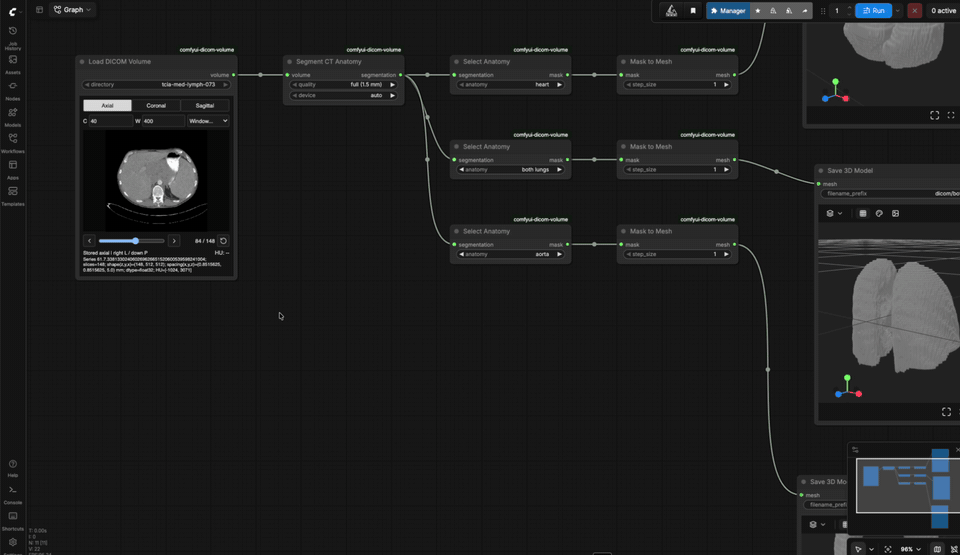
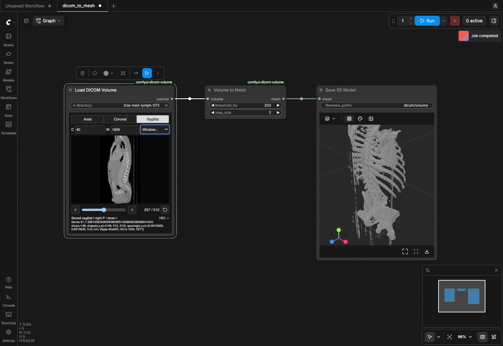

# DICOM Volume

Turn a CT scan into a 3D mesh inside ComfyUI. Load a DICOM series, scrub through
it in an interactive slice viewer on the node, and extract a surface that saves
as a GLB through the core **Save 3D Model** node. Optionally, segment named
organs (heart, lungs, aorta and the rest of a 117-structure CT catalog) with
TotalSegmentator and mesh each one.
**Not for clinical use.**



<sub>Sample: TCIA CT Lymph Nodes, case MED_LYMPH_073. Roth et al. (2015),
[doi:10.7937/K9/TCIA.2015.AQIIDCNM](https://doi.org/10.7937/K9/TCIA.2015.AQIIDCNM),
[CC BY 3.0](https://creativecommons.org/licenses/by/3.0/). Displayed with windowing
and resizing; recording sped up 1.6x.</sub>

## Quick Install

For an existing ComfyUI install (Python 3.12+), run from the ComfyUI root using the
same Python that runs ComfyUI:

```sh
git clone https://github.com/pcapp/comfyui-dicom-volume.git custom_nodes/comfyui-dicom-volume
python -m pip install -r custom_nodes/comfyui-dicom-volume/requirements.txt
python custom_nodes/comfyui-dicom-volume/scripts/fetch_sample.py --input-root input
```

Restart ComfyUI, then drag `example_workflows/dicom_to_mesh.json` onto the canvas,
select `tcia-med-lymph-073` in **Load DICOM Volume** and click Run. The sample
download is about 78 MB; see [SAMPLE_DATA.md](SAMPLE_DATA.md) for its license.
No models or GPU are needed for this workflow. Organ segmentation has its own
optional setup in [SEGMENTATION.md](SEGMENTATION.md).

| Workflow | Nodes |
| --- | --- |
| `dicom_to_mesh.json` | Load DICOM Volume → Volume to Mesh → Save 3D Model |
| `dicom_organs.json` | Load DICOM Volume → Segment CT Anatomy → Select Anatomy → Mask to Mesh → Save 3D Model |
| `load_dicom_volume.json` | Load DICOM Volume only (slice viewer and summary) |

The full tested setup below starts from a fresh ComfyUI clone.

## Tested Setup

The commands below are for a manual ComfyUI installation on macOS/Linux with
Git and [uv](https://docs.astral.sh/uv/getting-started/installation/) installed.
The clean-install check used ComfyUI 0.37.0 with frontend 1.53.6 on Apple Silicon,
Python 3.13 for ComfyUI, and Python 3.12 for the optional segmentation worker.
Older host versions are not covered by that check. Windows portable/Desktop installs
have different interpreter paths; these shell commands do not cover them.

### Get ComfyUI and This Extension

If you already have a working ComfyUI checkout, keep its environment and skip
the host installation commands. Otherwise, in a directory of your choice:

```sh
git clone https://github.com/Comfy-Org/ComfyUI.git
cd ComfyUI
uv venv --python 3.13 .venv
uv pip install --python .venv/bin/python -r requirements.txt
cd ..
```

This is the CPU-capable host setup tested on Apple Silicon. For other hardware
or GPU acceleration in ComfyUI itself, follow the
[official manual installation guide](https://docs.comfy.org/installation/manual_install).
The optional segmentation worker chooses its own device independently.

Clone the extension next to your ComfyUI checkout:

```sh
git clone --branch main https://github.com/pcapp/comfyui-dicom-volume.git
cd comfyui-dicom-volume
```

Preserve local changes and use your host's own interpreter. From this extension
checkout, set the paths (replace `COMFY_ROOT` if your host lives elsewhere):

```sh
EXTENSION_ROOT="$PWD"
COMFY_ROOT="$(cd ../ComfyUI && pwd)"
git status --short --branch
git -C "$COMFY_ROOT" status --short --branch
"$COMFY_ROOT/.venv/bin/python" -c 'import sys; print(sys.executable, sys.version)'
```

Link this checkout into the host's `custom_nodes` only if no entry already exists:

```sh
ln -s "$EXTENSION_ROOT" "$COMFY_ROOT/custom_nodes/comfyui-dicom-volume"
uv pip install --python "$COMFY_ROOT/.venv/bin/python" -r requirements.txt
```

Runtime requirements are NumPy, SimpleITK and scikit-image. PyTorch and `comfy_api`
come from ComfyUI; do not install a PyPI package named `comfy_api`. Do not run
`uv sync` against the shared host environment. The extension's separate test
environment is managed with `uv sync --locked`.

Restart your own host after Python changes. CPU execution is sufficient and no
diffusion models are required. For a new host, select a free port, then run:

```sh
cd "$COMFY_ROOT"
"$COMFY_ROOT/.venv/bin/python" main.py --cpu --disable-api-nodes --listen 127.0.0.1 --port 8188
```

Do not stop an unrelated process. Open the URL printed by the host.

## Run the Workflow



1. Read [SAMPLE_DATA.md](SAMPLE_DATA.md) for the public sample, its explicit
   downloader command, TCIA citation, CC BY 3.0 license and usage policy. Download
   that sample, or put your own supported series beneath the host's input
   directory; refresh the browser after adding folders. The nodes never download
   data. Run the sample command from the extension directory, not the host
   directory used to start ComfyUI.
2. Open or drag `example_workflows/dicom_to_mesh.json` onto the ComfyUI canvas.
   This is API-format JSON supported by the installed frontend. Select the
   input folder in `Load DICOM Volume`; the example uses `tcia-med-lymph-073`.
3. Run with `threshold_hu=200` and `step_size=2`. SaveGLB appears as
   `Save 3D Model` and displays the saved mesh in its embedded preview. Files
   default to `output/dicom/volume_00001_.glb`, with an incrementing counter.
   A separate Preview3D node is unnecessary and does not accept MESH directly.

The threshold acts on original HU values. A higher threshold changes the surface;
this is not anatomical segmentation. Step 1 samples every voxel; larger integer
steps run faster and may miss thin structures. Cropped anatomy can produce open
surfaces. Marching cubes may skip a trailing voxel interval when its length is
not divisible by the step. Nothing is padded, capped, cropped, smoothed,
decimated or resampled by the extension.
No surface means adjusting the threshold or reducing the step, not fabricating
geometry. The volume and mesh must fit in RAM.

Retain [sample attribution and policy](SAMPLE_DATA.md) with sample-derived meshes,
images and screenshots. Generated data and reports belong under ignored
`artifacts/` (or the host output directory), never in commits. DICOM metadata and
derived geometry can be identifying; public availability is not a privacy audit.

## Slice Viewer

After running, use the loader's Axial/Coronal/Sagittal controls, slider, arrows,
or mouse wheel over the image. C/W set window center/width in HU; presets include
soft tissue, bone and lung. Right-drag or Shift-drag changes window/level
(horizontal: width, vertical: center). Width must be positive and finite.
The cursor readout uses original float32 HU and clears outside the image.

These are **stored-axis planes**, not anatomical reformats of an oblique scan.
Right/down labels come from the DICOM direction matrix. Pixel spacing determines
the displayed aspect; node resizing adds letterboxing. Viewer controls never
queue loading or meshing.

Axis, index and window settings are saved in workflow node properties. After
reopening or refreshing, run the workflow to attach the viewer. For an expired
handle, run again: the loader fingerprint forces renewal even with unchanged
files. This recovery can also rerun downstream meshing. The retry icon only
refetches a slice, without queuing.

The server retains at most eight volume references totaling 1 GiB, with a
10-minute idle lifetime. Larger volumes still flow to mesh nodes but have no
slice preview. Each viewer caches at most 12 slices / 32 MiB. See
[VIEWER.md](VIEWER.md) for orientation, transport and lifecycle details.

### Frontend Development

The distribution includes `web/viewer.js`; normal installs need no Node/build
step. After changing `frontend/`, use Node 22.12+ (or supported newer Node):

```sh
npm ci
npm run typecheck
npm test
npm run build
```

Keep the rebuilt bundle and `package-lock.json` with the source. Refresh ComfyUI
after frontend changes; restart your host after Python changes. TypeScript,
Vite, Vitest, jsdom and Lucide are development dependencies. The browser bundle
has no external runtime downloads. See [icon licensing](THIRD_PARTY_NOTICES.md).
aiohttp is supplied by ComfyUI at runtime and is an extension test dependency.

## Coordinates and Units

`loader.Volume` is unchanged:

| Field | Meaning |
| --- | --- |
| `voxels` | NumPy float32 HU, indexed `(z,y,x)` |
| `spacing` | `(x,y,z)` voxel spacing in mm |
| `origin` | Voxel `(0,0,0)` position in DICOM LPS mm |
| `direction` | Row-major 3x3 matrix; columns give physical x/y/z directions |
| `series_uid` | Selected series UID |
| `source_files` | Files in GDCM spatial order |

Physical position is `origin + direction @ ([x,y,z] * spacing)`.
Meshing explicitly permutes marching-cubes `(z,y,x)` coordinates and applies this
affine once. Winding is reversed when that transform reflects coordinates;
gradient normals use its inverse transpose and are renormalized.

The MESH adapter outputs `(X,Y,Z)=(-L,S,P)/1000`: right-handed metres, superior up,
anterior toward negative Z. The rotation preserves handedness. Origin is retained;
there is no centering or dimension normalization. Inverse mapping to DICOM mm is
`(L,P,S)=1000*(-X,Z,Y)`. The core exporter writes positions unchanged.
[glTF specifies metres and a right-handed Y-up coordinate system](https://registry.khronos.org/glTF/specs/2.0/glTF-2.0.html#coordinate-system-and-units).
The host viewer may frame the object for display; the saved GLB retains physical
coordinates. Use core SaveGLB for this coordinate-preserving export.

## Verification and Limits

From the extension checkout:

```sh
uv sync --locked
.venv/bin/python -m pytest -q --tb=short
```

See [VERIFICATION.md](VERIFICATION.md) for the tested environment, results and
host check commands. `example_workflows/load_dicom_volume.json`
still runs the loader alone and displays its geometry/HU summary.

The loader selects the largest eligible conventional single-frame CT series,
breaking ties by ascending UID. It excludes localizers and other modalities,
checks containment (including symlinks), recognizes extensionless DICOM, validates
regular geometry and retains oblique orientation and fractional HU. GDCM applies
slope/intercept once. A file-stat fingerprint invalidates ComfyUI's own cache;
there is no duplicate volume cache.

At least two slices are required. Enhanced/multiframe CT, irregular/duplicate
positions, varying orientation or spacing, and gantry shear require an appropriate
regular reconstruction. The viewer does not provide anatomical resampling,
segmentation, annotations or clinical interpretation.

Code: [MIT](LICENSE). Sample data has its own attribution and license.
